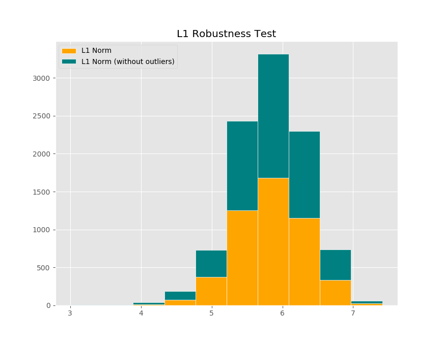

Setting up the problem, we define our cost functions as the corresponding L1 and L2 norms. This was done by passing it through cvxpy with no work done on the dataset (i.e. removing outliers). Using the code generated below
```python
# defining the cost functions depending on the norm and dataset
obj1 = cvx.Minimize(cvx.norm(X@B1 - y, 1))
obj2 = cvx.Minimize(cvx.norm(X @ B2 - y, 2))
obj1_out = cvx.Minimize(cvx.norm(X_out@B3 - y_out, 1))
obj2_out = cvx.Minimize(cvx.norm(X_out@B4 - y_out, 2))
```
we get the following vector of estimator values
```
Optimal value for L-1:   [-2.89801820e-02 -2.07462350e+00 -1.65467288e-01  2.72708582e-02
-1.74214507e+00  5.33818771e-03 -9.12684027e-04  1.15692042e+00
3.97386730e-01  5.59358349e-01  3.64033370e-01]
Optimal value for L-2:   [-5.05906677e-02 -1.95851041e+00 -2.93489981e-02  2.49883934e-02
-9.42583777e-01  4.79078528e-03 -8.77630526e-04  2.04204660e+00
1.68395150e-01  4.16453142e-01  3.65633386e-01]
```

Now, we will remove the outliers per column/feature as a single outlier on one axis will throw off measurements for the regression output. We removed the outliers though pandas with the following snippet
```python
data = np.genfromtxt("winequality-white.csv", delimiter=";", skip_header=1)
data_out = data[(np.abs(stats.zscore(data)) < 3).all(axis=1)]
```
removing the outliers depicted below


This removed about 500 samples and gave us the following vectors for our estimators
```
Optimal value for L-1 (with outliers removed):   [-7.38108346e-03 -1.91520550e+00  3.26969989e-02  2.88229568e-02
-6.32630212e+00  6.16657734e-03 -9.45618573e-04  7.40971906e-01
5.12398144e-01  6.69022989e-01  3.55596180e-01]
Optimal value for L-2 (with outliers removed):   [-2.50063860e-02 -1.77077832e+00 -2.35269917e-02  2.63260778e-02
-5.27053607e+00  6.03682640e-03 -6.88683169e-04  1.59675718e+00
3.07159541e-01  4.23342639e-01  3.55451762e-01]
```
To quantitatively determine what happened when we removed the outliers between L1 regression and L2 regression, we can look at their relative change between the estimators before and after outlier removal was done. Doing so (estimator-wise), we get the following vectors
```
L1 difference from outliers: [-0.74530583 -0.07684189 -1.197604    0.05691418  2.63132912  0.15518181
  0.03608538 -0.35953079  0.28941936  0.19605435 -0.02317697]
L2 difference from outliers: [-0.50571149 -0.09585452 -0.19837156  0.05353223  4.59158369  0.2600912
 -0.2152926  -0.21806036  0.82404031  0.01654327 -0.02784654]
```
To determine which one was overall more, I took the L-2 norm of these vectors as an overall magnitude, giving us the values
```
Normed value of L1 and L2 difference vectors: L1: 3.033176053834044 L2: 4.715021755804254
```
Here, we see that L2 changed more after we removed the outliers, showing that L1 regression was more robust to outliers.

Lastly, we can visualize the overall predictions by plotting the histograms from the raw and outlier removed dataset. Doing so, we have the following (which although slight, corroborates our findings)


Overall, L1 norm optimization was more robust due to less weighting of larger residuals and more on smaller ones. Although it was not fairly obvious, we can see the theory in the very least held from our results above. Again this is depicted by their respective changes once outliers were removed and that the histograms for each norm seem to correspond with the changes as the L1 norm was slightly less of a change.